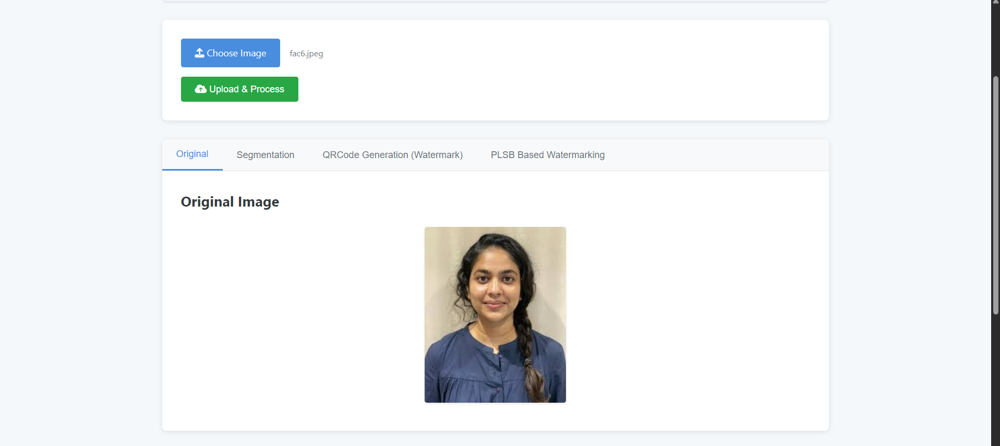
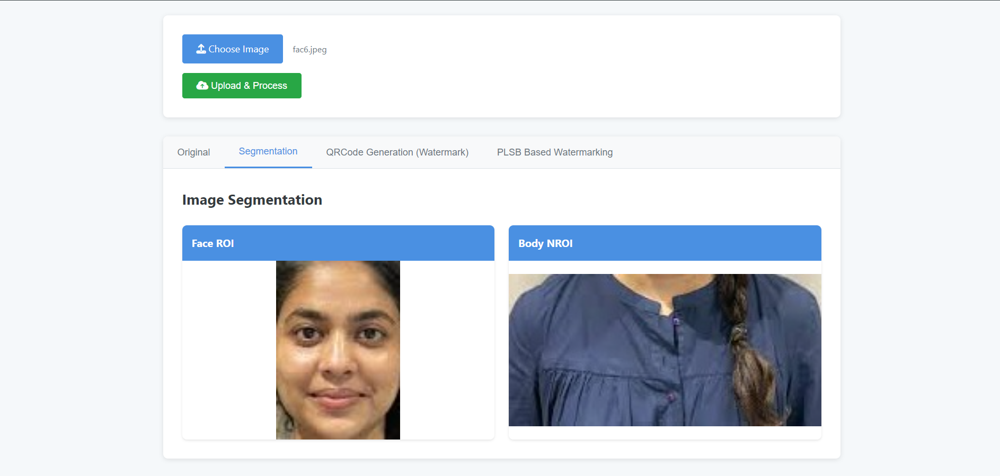
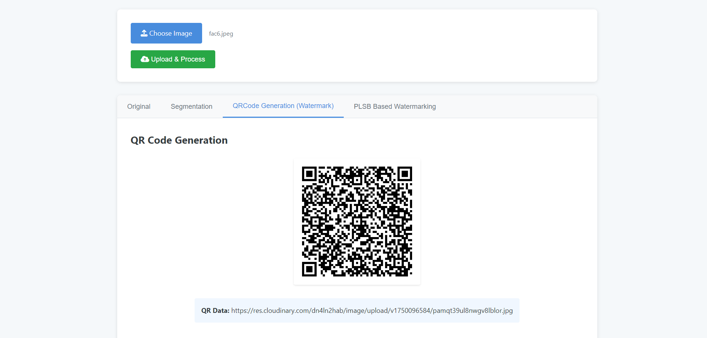
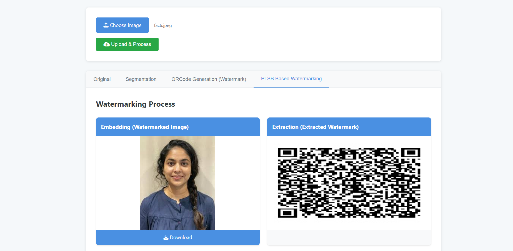
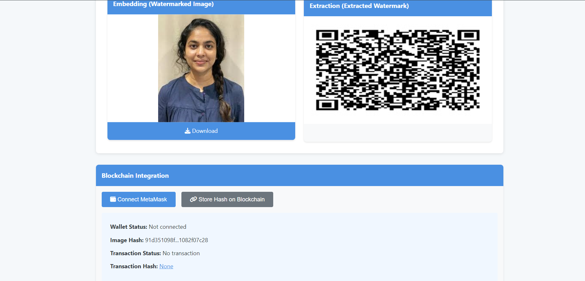
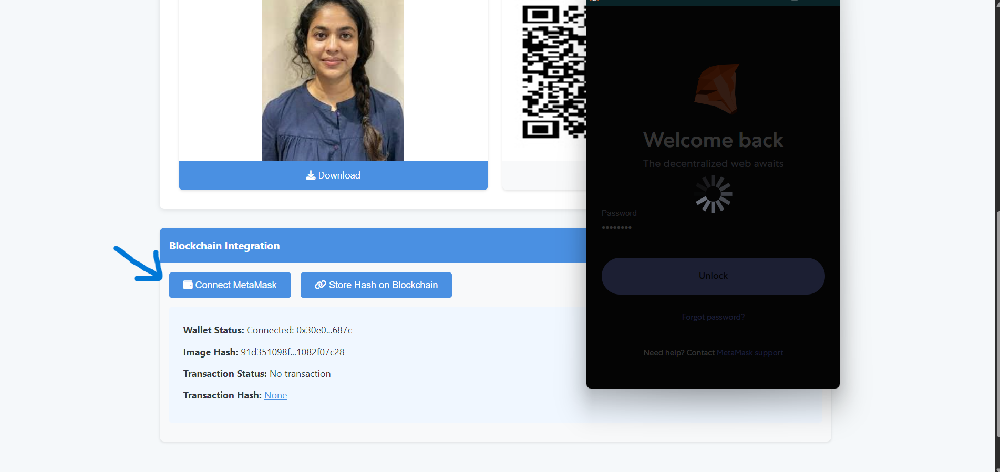
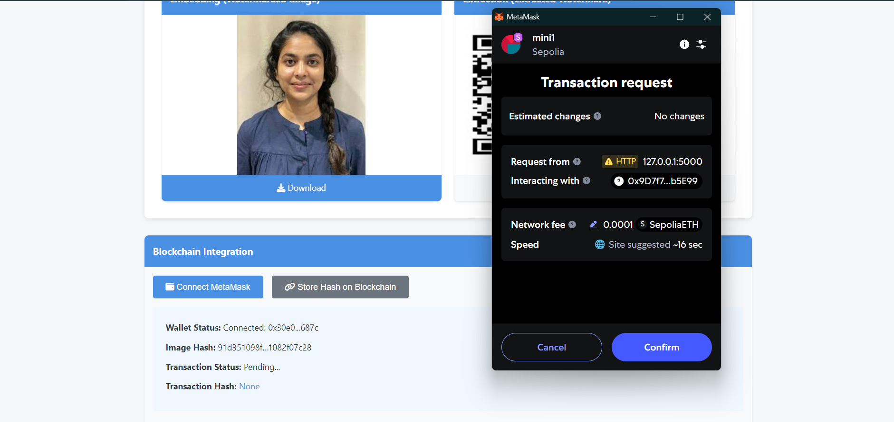
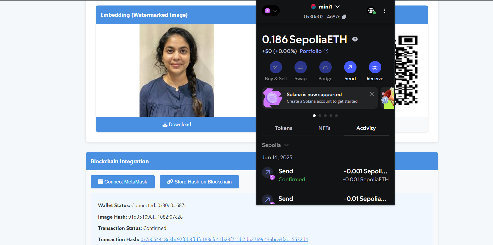
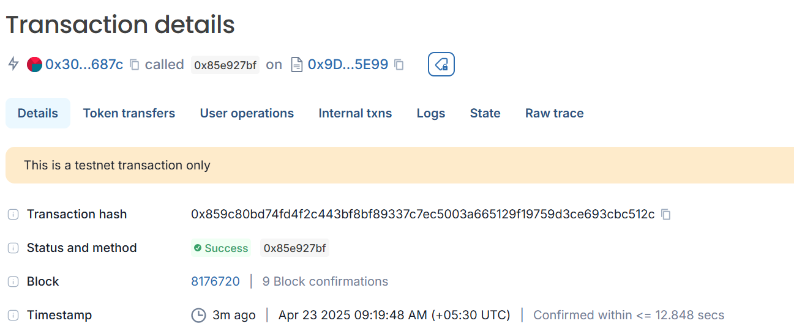

# BioChain – Blockchain Enabled Privacy Preservation of Watermarked Facial Images

**BioChain** is a privacy-preserving image security framework focused on protecting **biometric data**, specifically **facial images**. It integrates deep learning-based face detection, watermarking, and blockchain authentication. The system uses **MTCNN** to detect facial regions, generates a **QR code** from the facial data URL, embeds it in the non-facial region using **Penultimate Least Significant Bit (PLSB)** watermarking, and secures image integrity by storing its **SHA-256 hash on the Ethereum blockchain** via smart contracts.\

---

## 🧠 Project Overview

In sectors like healthcare and digital identity, facial images are vulnerable to tampering, spoofing, and deepfake attacks. Traditional watermarking techniques such as LSB, DCT, and DWT fall short in balancing security, efficiency, and integrity.

**BioChain** proposes:
- 🎯 Face detection using MTCNN (to extract RoI)
- 📦 QR generation of face URL (uploaded securely to Cloudinary)
- 💧 PLSB watermarking to embed QR into the body (non-sensitive region)
- 🔐 SHA-256 hash generation of final image
- 🔗 Blockchain-based verification using Ethereum and MetaMask

---

## 🔧 Tech Stack

- `Python`, `OpenCV`, `qrcode`, `MTCNN`
- `Cloudinary` for cloud storage
- `Solidity`, `Remix IDE`, `MetaMask`, `Ethereum`, `Blockscout`
- `Git`, `GitHub`, `Markdown`

---

## 🚀 Getting Started

### 🔁 Clone the Repository

```bash
git clone https://github.com/AkshithaYadav-Bathula/BIOCHAIN-PLSB-BCT-WATERMARKING-.git
cd BIOCHAIN-PLSB-BCT-WATERMARKING-
```


### Create and Activate Virtual Environment

```bash
python -m venv venv
venv\Scripts\activate  # For Windows
```

### Install Dependencies

```bash
pip install -r requirements.txt
```

### API Setup

Sign up at Cloudinary

Get your Cloud Name, API Key, and Secret

Create a .env file and add:

```bash
CLOUD_NAME=your_cloud_name
API_KEY=your_api_key
API_SECRET=your_api_secret
```

### 🔗 Smart Contract & Blockchain Integration

This project uses an Ethereum smart contract (`ImageHashStorage.sol`) to securely store watermarked image hashes on the blockchain.

### 🚀 Deploy Smart Contract Steps

- Open [Remix IDE](https://remix.ethereum.org) and create a new workspace
- Add `ImageHashStorage.sol` under `contracts/` and compile using Solidity ^0.8.x
- Connect [MetaMask](https://metamask.io/) and switch to the **Sepolia Testnet**
- Get test ETH from the [Google Cloud Sepolia Faucet](https://faucet.quicknode.com/ethereum/sepolia)
- Deploy the contract using Injected Web3 (MetaMask)
- Use `storeHash()` to store image hashes and `getHashes()` to retrieve
- Verify transactions on [Blockscout – Sepolia](https://sepolia.blockscout.com)

> ✅ Ensures immutable and decentralized verification of facial watermark integrity.

### Run the project 

```bash
python app.py
```

---

## 🔄 Full Workflow – With Screenshots

### 1. Upload Image
- Initial UI for uploading input image


### 2. Face and Body Detection
- MTCNN detects and extracts facial regions (RoI)


### 3. QR Code Generation
- A QR code is created from the Cloudinary-hosted facial image URL


### 4. PLSB Watermarking
- QR is embedded into the body region (non-facial) using Penultimate LSB


### 5. SHA-256 Hash Generation
- Final watermarked image is hashed securely


### 6. MetaMask Transaction Popup
- User is prompted to sign a transaction storing hash on Ethereum


### 7. Store Hash Using Smart Contract
- The `storeHash()` function of the smart contract is triggered


### 8. Transaction Confirmation on Blockchain
- User sees confirmation of the successful transaction


### 9. Blockscout Transaction View
- QR data integrity validated via hash retrieval from blockchain


---

> 📁 **Note**: All images are stored in the `/screenshots` directory. 


